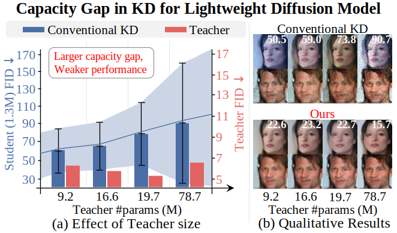

# [CVPR 2026] Singular Value Scaling: Efficient Generative Model Compression via Pruned Weights Refinement

### [Arxiv](https://arxiv.org/pdf/2605.19729) / [Project Page](https://hyun-s.github.io/LIFT_PLACE_site/)

Authors: Hyunsoo Han, Sangyeop Yeo, [Jaejun Yoo](https://scholar.google.co.kr/citations?hl=en&user=7NBlQw4AAAAJ)

---


---

## Codes for Diff-Pruning, BK-SDM and TinyFusion
Please refer following codes for each model.
- DDPM: [Diff-Pruning](Diff_Pruning_EXP/)
- Stable Diffusion: [BK-SDM](BK_SDM_EXP/)
- DiT: [TinyFusion](TinyFusion_EXP/)


## Acknowledgements
We sincerely thank the authors of Diff-Pruning, BK-SDM, and TinyFusion for open-sourcing their excellent codebases and providing strong baselines for generative model compression.

Their contributions provided a solid foundation for developing and evaluating this work across DDPM, Stable Diffusion, and Diffusion Transformer architectures.

**Diff-Pruning**
```bash
@inproceedings{fang2023structural,
  title={Structural pruning for diffusion models},
  author={Gongfan Fang and Xinyin Ma and Xinchao Wang},
  booktitle={Advances in Neural Information Processing Systems},
  year={2023},
}
```


**BK-SDM**
```bash
@inproceedings{kim2024bk,
  title={Bk-sdm: A lightweight, fast, and cheap version of stable diffusion},
  author={Kim, Bo-Kyeong and Song, Hyoung-Kyu and Castells, Thibault and Choi, Shinkook},
  booktitle={European Conference on Computer Vision},
  pages={381--399},
  year={2024},
  organization={Springer}}
```


**TinyFusion**
```bash
@inproceedings{fang2025tinyfusion,
  title={Tinyfusion: Diffusion transformers learned shallow},
  author={Fang, Gongfan and Li, Kunjun and Ma, Xinyin and Wang, Xinchao},
  booktitle={Proceedings of the Computer Vision and Pattern Recognition Conference},
  pages={18144--18154},
  year={2025}}
```

## Cite this work
If you found this repository useful, please consider giving a star and citation:
```bash
@inproceedings{han2026lift,
  title={LIFT and PLACE: A Simple, Stable, and Effective Knowledge Distillation Framework for Lightweight Diffusion Models},
  author={Han, Hyunsoo and Yeo, Sangyeop and Yoo, Jaejun},
  booktitle={Proceedings of the IEEE/CVF Conference on Computer Vision and Pattern Recognition},
  pages={5564--5573},
  year={2026}
}
```
